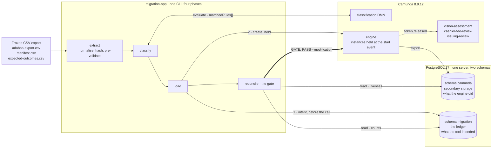

# Adabas to Camunda 8: in-flight process migration POC

A proof of concept for migrating **in-flight** business processes off a mainframe Adabas file
into a running Camunda 8 BPMN process.

The hard part is not moving rows. A government registry runs "apply for a learner permit" on
Adabas with no workflow engine, so process state was never recorded: it is implicit in
combinations of field values (`issued`, `expired`, `date_completed`, `fee_paid`, `visual_test`).
A hard cutover is mandated, dual-run is ruled out, and thousands of applications are live on
the day of the switch. The migration therefore has to **infer** where each case sits in a
process that was never written down, and place a token there.

This POC proves the inference can be done correctly with every exception accounted for. It
does not claim production readiness, and it says nothing about real Adabas data: the file model
in `fixtures/` is synthetic and the expected outcomes are hand-written.

## The claim being demonstrated

Every record in a frozen export lands in exactly one of three places:

- a **held token** at a BPMN element, waiting for the right back-office group,
- a **skip** with a reason code, or
- a **quarantine** with a reason code.

The three add up to the manifest count, and nothing reaches a human until a gate says the
arithmetic balances and the engine agrees with the ledger.

With the 13 shipped fixtures that is **3 MIGRATE, 4 SKIP, 6 QUARANTINE**, and all 13 match the
independently written expectations file.

## Quick start

Needs Docker Desktop, Java 21 and Maven. Host ports 18080, 36500, 19600 and 15432 must be free;
they are deliberately non-default so another Camunda stack can run alongside on the usual ones.

```sh
docker compose up -d                  # Postgres 17 + Camunda 8.9.12, healthy in ~15-25s
mvn -f migration-app/pom.xml package  # 44 tests, builds the CLI jar

# deploy the models (not yet scripted)
curl -s -F "resources=@processes/learner-permit-migration.bpmn" \
        -F "resources=@processes/migration-classification.dmn" \
        http://localhost:18080/v2/deployments

APP="java -jar migration-app/target/migration-app-0.1.0-SNAPSHOT.jar"
FIX="fixtures/adabas-export.csv fixtures/manifest.csv fixtures/expected-outcomes.csv"

$APP migrate $FIX --dry-run   # classify only, creates nothing
$APP migrate $FIX             # classify, load, gate, stop at the verdict
$APP migrate $FIX --release   # the above, then release, only on GATE: PASS
```

Operate is at <http://localhost:18080/operate>. Reset with
`docker compose down -v && docker compose up -d`, then redeploy: the Postgres init scripts only
run on an empty volume, so `-v` is required.

On **Windows PowerShell 5.1** the shorthand above does not work. Declare a function instead,
spell out `curl.exe`, and use `Invoke-RestMethod` for the search bodies. `docs/demo-spec.md` has
the full set of substitutions, and they are not optional: silently dropped quotes turn a
filtered search into a historical one that returns terminal rows too.

## How it works



**Where Postgres sits.** One server carries both sides of the migration, in two schemas with
separate owners and no cross grants: the app cannot write the engine's projection and the engine
cannot see the ledger. That separation is what makes the gate meaningful. The `migration` schema
records what this tool *intended* for every case, written before the engine is called. The
`camunda` schema is the engine's own exported projection of what actually happened, and it is
what the v2 search API answers from. The gate reads both and refuses to release unless they
agree, which is the only way to notice an instance somebody cancelled by hand in Operate.

It is also why the gate waits instead of sampling. The exporter flushes every 0.5s, so a held
instance that has not reached the `camunda` schema yet looks exactly like one that was
cancelled. A single query cannot tell those apart; the gate polls each held instance up to
`migration.visibility-timeout` before calling it missing.

### Per-record decision path

```
CSV export
    |
    v
extract     read freezeDate + cutoffMonths from the manifest, discover the
            VT_<n>_* / RESTR_<n> occurrence columns, hash each source line
            against the manifest, normalise every DMN input to a total value,
            pre-validate            ---> QUARANTINE_PREVALIDATION
    |
    v
classify    evaluate the DMN (COLLECT, no catch-all row)
    |
    +-- 0 hits            -> QUARANTINE_UNMATCHED
    +-- 1 distinct output -> MIGRATE | SKIP | QUARANTINE
    +-- 2+ identical      -> proceed, count REDUNDANT_RULE
    +-- 2+ distinct       -> QUARANTINE_AMBIGUOUS
    |
    v
load        write ledger intent to Postgres BEFORE the engine call, then create
            the instance. It halts at the start event, held by a `migrator`
            execution listener, before any sequence flow is traversed.
    |
    v
reconcile   the gate. Only if it passes: one modification per instance that
            activates the target element with its variables and terminates the
            start-event token. The held job then cancels itself.
    |
    v
vision-assessment | cashier-fee-review | issuing-review
```

Holding every instance at the start event is Camunda's own documented runtime-migration
mechanism. It means a half-finished load leaves nothing in front of a clerk, and the whole
population becomes visible before anything is released.

## The classification table

`processes/migration-classification.dmn`, hit policy `COLLECT`, no catch-all row. A dash is
"don't care".

| Rule | completed | issued | expired | withinCutoff | feePaid | vision | Outcome | Target / reason |
|---|---|---|---|---|---|---|---|---|
| R1 | true | - | - | - | - | - | SKIP | `COMPLETED` |
| R2 | false | true | false | - | - | - | SKIP | `LIVE_PERMIT` |
| R3 | false | true | true | - | - | - | SKIP | `EXPIRED_HISTORICAL` |
| R4 | false | false | - | false | - | - | QUARANTINE | `OUT_OF_CUTOFF` |
| R5 | false | false | - | true | false | NONE | MIGRATE | `vision-assessment` |
| R6 | false | false | - | true | false | PASS | MIGRATE | `cashier-fee-review` |
| R7 | false | false | - | true | true | PASS | MIGRATE | `issuing-review` |
| R8 | false | false | - | true | false | FAIL | SKIP | `TERMINATED_VISION_FAIL` |

Over the 96-cell input domain (2^5 x 3) the rules cover 92 cells with zero multi-hits. The four
uncovered cells all have `feePaid = true` with no passing vision test, which is a business
impossibility, so they quarantine rather than being guessed at.

R4 is quarantine and not skip on purpose. An out-of-cutoff case that is not completed, not
issued and not expired is still live, and once Adabas is switched off, silently skipping it
means the case exists in no system at all.

## The properties that make it safe

These are the non-obvious parts, and `docs/designs/` argues each one at length.

**Every DMN input is total.** In FEEL an input entry tested against null generally does not
match, so a single null would quietly fall to zero hits and quarantine. The unmatched count
would then be measuring FEEL semantics instead of rule coverage.

**`withinCutoff` comes from the manifest's freeze date, never the clock.** Rerunning the same
export a week later must not reclassify anything.

**Match detection reads `evaluatedDecisions[].matchedRules[]`, never the top-level DMN output.**
A non-match returns the *string* `"null"` there, so branching on it treats "no match" as a value.

**Ledger intent is written before the engine call**, which makes a 409 on create evidence of
success rather than a failure, and makes a crash mid-create a durable `CREATE_PENDING` rather
than an unanswerable question.

**The ledger is intent, never evidence about the engine.** Bucket counts balance by
construction, so they cannot detect an instance cancelled outside the tool. The gate therefore
liveness-checks every created row against the engine itself, and waits up to a configurable
timeout for each held instance to appear in secondary storage rather than sampling once:
"cancelled" and "not exported yet" look identical to a single query.

**The load is idempotent.** Rerun it and it reports what already exists and touches nothing, so
an interrupted cutover is resumed by running the same line again.

**The gate has no bypass.** `--release` on a `GATE: FAIL` prints `RELEASE REFUSED` and exits 1,
and a failed expectation check halts before the load rather than creating instances from a
population just reported as wrong.

## Layout

| Path | What |
|---|---|
| `docker-compose.yml`, `.env`, `docker/` | Postgres 17 and Camunda 8.9.12 on non-default ports |
| `processes/` | The BPMN (3 back-office tasks, `migrator` listener on the start event) and the DMN |
| `fixtures/` | 13 synthetic records, the freeze manifest, hand-written expected outcomes |
| `migration-app/` | Spring Boot CLI: `classify`, `load`, `reconcile`, and `migrate` chaining the three |
| `docs/demo-spec.md` | The runbook, including how to make the gate refuse |
| `docs/designs/` | The argument behind every choice above |

## Tests

```sh
mvn -f migration-app/pom.xml package
```

44 tests. All but one run with nothing started. `DecisionTableDomainTest` evaluates the DMN
deployed from `processes/`, so it asserts the behaviour of the real table and needs Docker and
the compose Postgres up.

## Scope

Out of scope by decision, not by omission: the extract path from production z/OS (Adabas SQL
Gateway licensing is unresolved), mapping legacy user ids to identity-provider subjects, volume
certification, and the triage process the quarantined records would be resolved in. Citizen-facing
tasks are never migration targets: they are assigned individually, so a migrated one carrying a
legacy username would lock the applicant out of their own application.

The largest open risk is unaddressed here and known to be: the unmatched rate against real data.
This POC proves the machinery, and a green run says nothing about how many real records the rule
set would fail to classify.
